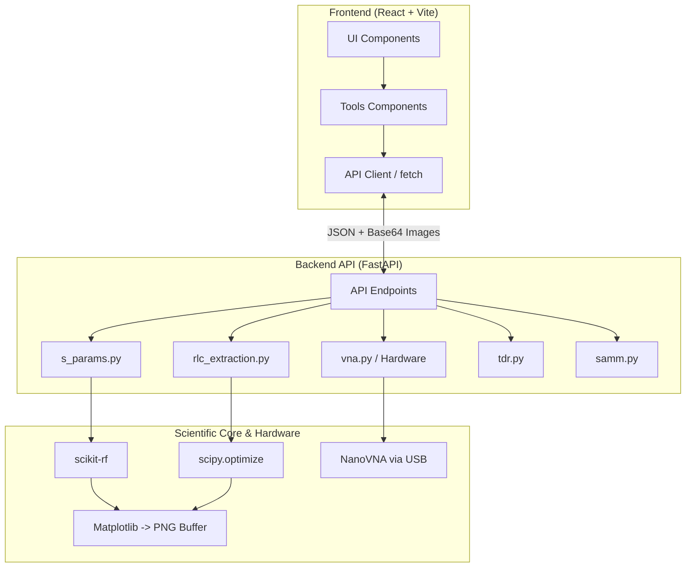

# Schematics and Diagrams - RF & Signal Integrity Suite

This document contains the source code to generate architecture and flow diagrams for the various application modules. The schematics are designed in **TikZ** (for direct LaTeX integration) and **Mermaid** (for quick visualization in Markdown/Web).

## Instructions for LaTeX (TikZ)

To compile these graphics in your LaTeX document, ensure you include the following libraries in your `.tex` file preamble:

```latex
\usepackage{tikz}
\usetikzlibrary{shapes.geometric, arrows, positioning, fit, backgrounds, calc}

% Global style definitions for flowcharts
\tikzstyle{startstop} = [rectangle, rounded corners, minimum width=2.5cm, minimum height=1cm, text centered, draw=black, fill=red!20]
\tikzstyle{io} = [trapezium, trapezium left angle=70, trapezium right angle=110, minimum width=2.5cm, minimum height=1cm, text centered, draw=black, fill=blue!10]
\tikzstyle{process} = [rectangle, minimum width=3cm, minimum height=1cm, text centered, text width=4cm, draw=black, fill=orange!10]
\tikzstyle{decision} = [diamond, minimum width=2.5cm, minimum height=1cm, text centered, draw=black, fill=green!20, aspect=1.5]
\tikzstyle{arrow} = [thick,->,>=stealth]
\tikzstyle{cloud} = [ellipse, draw, fill=gray!10, text centered, minimum height=1cm]
```

---

## 1. General Architecture and Real-World Communication (Web/App <-> API <-> Hardware)

This schematic shows how the different system layers communicate in a real-world scenario, from the React UI to the VNA via USB, highlighting the use of Base64 for plots.

### TikZ Code
```latex
\begin{figure}[h!]
\centering
\begin{tikzpicture}[node distance=2.5cm, auto]

    % Nodes
    \node [process, fill=cyan!10] (front) {\textbf{Frontend} \\ React, Vite, Tailwind \\ (UI, Forms, State)};
    \node [process, fill=purple!10, right=3.5cm of front] (api) {\textbf{Backend API} \\ FastAPI, Uvicorn \\ (Routes, Orchestration)};
    \node [cloud, below=2cm of api] (logic) {\textbf{Python Logic Core} \\ skrf, scipy, numpy \\ (Calculations, Fitting)};
    \node [process, fill=gray!20, right=3cm of api] (vna) {\textbf{Hardware} \\ NanoVNA \\ (Serial Port / USB)};
    \node [cloud, right=3.5cm of logic] (plot) {\textbf{Graphics Generator} \\ Matplotlib \\ (Memory Buffer)};
    \node [process, fill=yellow!20, below=2cm of front] (desktop) {\textbf{Desktop View} \\ PyWebView};

    % Connections
    \draw [arrow, <->] (front) -- node[anchor=south, text width=3.5cm, align=center] {REST / HTTP \\ (JSON)} (api);
    \draw [arrow, dashed] (api) -- node[anchor=east] {Function calls} (logic);
    \draw [arrow, <->] (api) -- node[anchor=south, text width=3cm, align=center] {SCPI Commands / \\ PySerial} (vna);
    \draw [arrow] (logic) -- node[anchor=north] {Data (x,y)} (plot);
    
    % Return arrow with Base64
    \draw [arrow, bend left=20] (plot.south) to node[anchor=north, text width=5.5cm, align=center] {Render to PNG $\rightarrow$ Base64 String \\ Embedded in JSON} (api.south);

    \draw [arrow] (desktop) -- node[anchor=east] {Renders localhost} (front);

\end{tikzpicture}
\caption{Communication Architecture: Frontend, Backend API, and Hardware}
\label{fig:communication_architecture}
\end{figure}
```

---

## 2. RLC Extraction Module (`rlc_extraction.py`)

Data flow schematic for converting S-parameters into RLC passive equivalent models using least squares curve fitting.

### TikZ Code
```latex
\begin{figure}[h!]
\centering
\begin{tikzpicture}[node distance=1.8cm, auto]

    \node (start) [startstop] {Extraction Start};
    \node (in1) [io, below=of start] {.s2p File or Memory Data};
    \node (pro1) [process, below=of in1] {S to Impedance Conversion ($Z_{11}, Z_{21}$) via \texttt{scikit-rf}};
    \node (pro2) [process, below=of pro1] {Equivalent Model Definition \\ (Transfer Function)};
    \node (pro3) [process, below=of pro2] {Least Squares Fitting \\ (\texttt{scipy.optimize.curve\_fit})};
    \node (dec1) [decision, below=of pro3, yshift=-0.5cm] {Error < Tolerance?};
    \node (pro4) [process, right=2cm of dec1] {Refine Initial Seeds};
    \node (out1) [io, below=of dec1, yshift=-0.5cm] {Final R, L, C Parameters};
    \node (plot) [process, below=of out1] {Generate Comparison Plot (S2P vs Model)};
    \node (stop) [startstop, below=of plot] {End};

    \draw [arrow] (start) -- (in1);
    \draw [arrow] (in1) -- (pro1);
    \draw [arrow] (pro1) -- (pro2);
    \draw [arrow] (pro2) -- (pro3);
    \draw [arrow] (pro3) -- (dec1);
    \draw [arrow] (dec1) -- node[anchor=south] {No} (pro4);
    \draw [arrow] (pro4) |- (pro3);
    \draw [arrow] (dec1) -- node[anchor=east] {Yes} (out1);
    \draw [arrow] (out1) -- (plot);
    \draw [arrow] (plot) -- (stop);

\end{tikzpicture}
\caption{Flowchart: RLC Parameter Extraction Module}
\end{figure}
```

---

## 3. VNA Calibration and Measurement Module (`vna.py`)

Flow of the SOLT (Short, Open, Load, Through) calibration wizard and data acquisition.

### TikZ Code
```latex
\begin{figure}[h!]
\centering
\begin{tikzpicture}[node distance=1.8cm, auto]

    \node (start) [startstop] {Connect VNA};
    \node (setup) [process, below=of start] {Configure Start/Stop Freq and Points};
    \node (calS) [process, below=of setup] {Measure \textbf{SHORT} Standard};
    \node (calO) [process, below=of calS] {Measure \textbf{OPEN} Standard};
    \node (calL) [process, below=of calO] {Measure \textbf{LOAD} Standard (50$\Omega$)};
    \node (calT) [process, below=of calL] {Measure \textbf{THROUGH} Standard};
    
    \node (apply) [process, right=2.5cm of calL] {Compute Error Coefficients \\ (12-Term Model)};
    \node (meas) [process, above=of apply] {Continuous S11, S21 Acquisition};
    \node (save) [io, above=of meas] {Export Calibrated .s2p};

    \draw [arrow] (start) -- (setup);
    \draw [arrow] (setup) -- (calS);
    \draw [arrow] (calS) -- (calO);
    \draw [arrow] (calO) -- (calL);
    \draw [arrow] (calL) -- (calT);
    \draw [arrow] (calT.east) -- ++(1,0) |- (apply.south);
    \draw [arrow] (apply) -- (meas);
    \draw [arrow] (meas) -- (save);

\end{tikzpicture}
\caption{SOLT Calibration Sequence and Measurement with NanoVNA}
\end{figure}
```

---

## 4. SAMM Module (Selection Automatic of Measurement Model)

Logical flow for the automatic selection of the measurement equivalent model based on frequency response.

### TikZ Code
```latex
\begin{figure}[h!]
\centering
\begin{tikzpicture}[node distance=2cm, auto]

    \node (start) [startstop] {Data Input (S-Params)};
    \node (feat) [process, below=of start] {Feature Extraction \\ (Resonant Freq, Q-Factor, Phase)};
    
    \node (evalA) [process, below left=of feat, xshift=-1cm] {Evaluate PI Model};
    \node (evalB) [process, below right=of feat, xshift=1cm] {Evaluate T Model};
    \node (evalC) [process, below=of feat] {Evaluate Series L/C};

    \node (comp) [decision, below=3cm of feat] {Which minimizes MSE error?};
    
    \node (out) [io, below=of comp] {Select Winning Model and Extract Params};
    \node (stop) [startstop, below=of out] {End SAMM};

    \draw [arrow] (start) -- (feat);
    \draw [arrow] (feat) -| (evalA);
    \draw [arrow] (feat) -| (evalB);
    \draw [arrow] (feat) -- (evalC);
    
    \draw [arrow] (evalA) |- (comp);
    \draw [arrow] (evalB) |- (comp);
    \draw [arrow] (evalC) -- (comp);
    
    \draw [arrow] (comp) -- (out);
    \draw [arrow] (out) -- (stop);

\end{tikzpicture}
\caption{Flowchart: Automatic Model Selection (SAMM)}
\end{figure}
```

---

## 5. Synthetic TDR Module (`tdr.py` - Time Domain Reflectometry)

Transformation of frequency domain data (S-Params) to the time domain for fault analysis in transmission lines.

### TikZ Code
```latex
\begin{figure}[h!]
\centering
\begin{tikzpicture}[node distance=1.8cm, auto]

    \node (start) [startstop] {S11 Data (Frequency Domain)};
    \node (window) [process, below=of start] {Apply Window (Hann, Hamming) \\ to reduce side lobes};
    \node (ifft) [process, fill=blue!10, below=of window] {Inverse Fast Fourier Transform (IFFT)};
    \node (time) [process, below=of ifft] {Convert to Impulse / Step Response};
    \node (dist) [process, below=of time] {Distance Calculation ($d = \frac{c \cdot v_f \cdot t}{2}$)};
    \node (plot) [io, below=of dist] {TDR Plot (Impedance vs Distance)};
    \node (stop) [startstop, below=of plot] {End};

    \draw [arrow] (start) -- (window);
    \draw [arrow] (window) -- (ifft);
    \draw [arrow] (ifft) -- (time);
    \draw [arrow] (time) -- (dist);
    \draw [arrow] (dist) -- (plot);
    \draw [arrow] (plot) -- (stop);

\end{tikzpicture}
\caption{Synthetic TDR Processing from S-Parameters}
\end{figure}
```

---

## 6. General Mermaid Diagram (Component View)

If you need to include a quick schematic in GitHub (README.md) or in Markdown documentation without compiling LaTeX, this is the equivalent Mermaid code:

